# 📈 Fluxo de Trading e Gestão de Risco

## 🔄 Visão Geral do Fluxo

```mermaid
graph TD
    A[Início] --> B[Escaneamento Inicial]
    B --> C{Ativos Válidos?}
    C -->|Sim| D[Escaneamento Contínuo]
    C -->|Não| B
    
    D --> E[Análise Técnica]
    E --> F{Sinal Detectado?}
    F -->|Não| D
    F -->|Sim| G{Trades < Máximo?}
    G -->|Não| D
    G -->|Sim| H[Executar Trade]
    
    H --> I[Monitorar Posição]
    I --> J{Atingiu Target?}
    J -->|Breakeven| K[Ajustar Stop Loss]
    J -->|Take Profit| L[Fechar Posição]
    J -->|Stop Loss| L
    J -->|Não| I
    
    K --> I
    L --> M[Registrar Resultado]
    M --> D
```



## 📊 Detalhamento dos Fluxos

### 1. Escaneamento Inicial

**Objetivo**: Identificar ativos válidos para trading

```python
def initial_scan_flow():
    """
    1. Buscar todos os pares USDT disponíveis
    2. Aplicar filtros de validação
    3. Salvar lista de válidos/inválidos
    """
    
    # Buscar mercados
    markets = api.fetch_markets()
    
    # Filtrar USDT
    usdt_pairs = [m for m in markets if m['quote'] == 'USDT']
    
    # Validar cada par
    for pair in usdt_pairs:
        ticker = api.fetch_ticker(pair['symbol'])
        
        is_valid = (
            ticker['quoteVolume'] >= MIN_VOLUME_24H and
            pair['active'] and
            ticker['bid'] > 0 and
            ticker['ask'] > 0
        )
        
        # Salvar resultado
        save_validation_result(pair['symbol'], is_valid, ticker)
```

### 2. Escaneamento Contínuo

**Objetivo**: Monitorar ativos válidos em busca de sinais

```python
async def continuous_scan_flow():
    """
    Loop infinito monitorando ativos válidos
    """
    while True:
        valid_assets = get_valid_assets()
        
        for asset in valid_assets:
            try:
                # Coletar dados
                spot_data = await fetch_spot_data(asset)
                candles_2h = await fetch_candles(asset, '2h')
                candles_4h = await fetch_candles(asset, '4h')
                
                # Calcular indicadores
                indicators = calculate_indicators(
                    spot_data, candles_2h, candles_4h
                )
                
                # Gerar sinal
                signal = generate_signal(indicators)
                
                # Processar sinal
                if signal in ['BUY', 'SELL']:
                    await process_trading_signal(asset, signal, indicators)
                    
            except Exception as e:
                log_error(f"Erro no scan de {asset}: {e}")
                
        await asyncio.sleep(SCAN_INTERVAL)
```

### 3. Detecção de Sinais

**Três regras principais de entrada**:

#### Regra 1: Cruzamento de Médias + RSI
```python
def check_ma_crossover_rule(indicators):
    """
    MM1 cruza Center + RSI entre 35-73
    """
    # Verificar cruzamento 2H
    cross_2h = detect_crossover(
        indicators['mm1_2h_prev'],
        indicators['mm1_2h'],
        indicators['center_2h_prev'],
        indicators['center_2h']
    )
    
    # Verificar cruzamento 4H
    cross_4h = detect_crossover(
        indicators['mm1_4h_prev'],
        indicators['mm1_4h'],
        indicators['center_4h_prev'],
        indicators['center_4h']
    )
    
    # RSI válido
    rsi_valid = 35 <= indicators['rsi'] <= 73
    
    if (cross_2h or cross_4h) and rsi_valid:
        return cross_2h or cross_4h  # BULLISH ou BEARISH
    
    return None
```

#### Regra 2: Distância entre Médias
```python
def check_ma_distance_rule(indicators):
    """
    MM1 distante da Center (2% em 2H ou 3% em 4H)
    """
    # Distância 2H
    distance_2h = abs(indicators['mm1_2h'] - indicators['center_2h']) / indicators['center_2h']
    
    # Distância 4H
    distance_4h = abs(indicators['mm1_4h'] - indicators['center_4h']) / indicators['center_4h']
    
    if distance_2h >= 0.02 or distance_4h >= 0.03:
        # Direção baseada na posição relativa
        if indicators['mm1_2h'] > indicators['center_2h']:
            return 'BUY'
        else:
            return 'SELL'
    
    return None
```

#### Regra 3: Spike de Volume
```python
def check_volume_spike_rule(indicators):
    """
    Aumento súbito de volume + direção das médias
    """
    current_volume = indicators['volume']
    avg_volume = indicators['volume_sma']
    
    if current_volume > (avg_volume * VOLUME_SPIKE_THRESHOLD):
        # Direção baseada nas médias
        if indicators['mm1'] > indicators['center']:
            return 'BUY'
        else:
            return 'SELL'
    
    return None
```

### 4. Execução de Trade

**Fluxo de execução**:

```python
async def execute_trade_flow(symbol, side, signal_data):
    """
    Executa ordem e configura gestão de risco
    """
    # 1. Verificar limites
    open_trades = get_open_trades_count()
    if open_trades >= MAX_CONCURRENT_TRADES:
        log_info(f"Limite de trades atingido: {open_trades}/{MAX_CONCURRENT_TRADES}")
        return
    
    # 2. Calcular tamanho da posição
    balance = await api.fetch_balance()
    position_size = calculate_position_size(
        balance['USDT']['free'],
        signal_data['price']
    )
    
    # 3. Executar ordem market
    order = await api.create_market_order(
        symbol=symbol,
        side=side,
        amount=position_size
    )
    
    # 4. Configurar stop loss
    stop_price = calculate_stop_loss(
        entry_price=order['price'],
        side=side,
        percentage=INITIAL_STOP_LOSS_PERCENT
    )
    
    stop_order = await api.create_stop_loss_order(
        symbol=symbol,
        side='sell' if side == 'buy' else 'buy',
        amount=position_size,
        stop_price=stop_price
    )
    
    # 5. Registrar trade
    trade = create_trade_record(
        symbol=symbol,
        side=side,
        order=order,
        stop_order=stop_order,
        signal_data=signal_data
    )
    
    # 6. Iniciar monitoramento
    start_position_monitoring(trade)
    
    return trade
```

### 5. Gestão de Posição

**Trailing Stop Progressivo**:

```python
async def monitor_position_flow(trade):
    """
    Monitora e ajusta stops conforme evolução
    """
    while trade.status == 'OPEN':
        # Buscar preço atual
        ticker = await api.fetch_ticker(trade.symbol)
        current_price = ticker['last']
        
        # Calcular P&L
        pnl_percentage = calculate_pnl_percentage(
            trade.entry_price,
            current_price,
            trade.side
        )
        
        # Verificar níveis de trailing stop
        for level in TRAILING_STOP_LEVELS:
            if pnl_percentage >= level['trigger']:
                new_stop = calculate_new_stop_loss(
                    trade.entry_price,
                    trade.side,
                    level['stop']
                )
                
                # Ajustar stop se melhorou
                if should_update_stop(trade.stop_loss, new_stop, trade.side):
                    await update_stop_loss(trade, new_stop)
                    log_info(f"Stop ajustado para {new_stop} (+{level['stop']*100}%)")
        
        # Verificar se stop foi atingido
        if check_stop_hit(current_price, trade.stop_loss, trade.side):
            await close_position(trade, current_price, 'STOP_LOSS')
            break
            
        await asyncio.sleep(5)  # Verificar a cada 5 segundos
```

## 🛡️ Gestão de Risco

### Cálculo de Posição
```python
def calculate_position_size(balance, price):
    """
    Calcula tamanho seguro da posição
    """
    # Máximo por trade
    max_position_value = balance * (MAX_POSITION_SIZE_PERCENT / 100)
    
    # Verificar mínimo da exchange
    if max_position_value < MIN_ORDER_SIZE_USDT:
        raise InsufficientBalanceError()
    
    # Calcular quantidade
    quantity = max_position_value / price
    
    return round_to_precision(quantity)
```

### Stop Loss Dinâmico
```python
def calculate_stop_loss(entry_price, side, percentage):
    """
    Calcula preço do stop loss
    """
    if side == 'BUY':
        return entry_price * (1 - percentage)
    else:  # SELL
        return entry_price * (1 + percentage)
```

### Trailing Stop
```python
def should_update_stop(current_stop, new_stop, side):
    """
    Verifica se deve atualizar o stop
    """
    if side == 'BUY':
        return new_stop > current_stop
    else:  # SELL
        return new_stop < current_stop
```

## 📊 Métricas de Performance

### KPIs Monitorados
- **Win Rate**: Taxa de trades lucrativos
- **Profit Factor**: Lucro total / Prejuízo total  
- **Maximum Drawdown**: Maior queda do pico
- **Average Trade Duration**: Tempo médio no trade
- **Risk/Reward Ratio**: Risco médio vs retorno

### Cálculo de Métricas
```python
def calculate_performance_metrics(trades):
    """
    Calcula métricas de performance
    """
    metrics = {
        'total_trades': len(trades),
        'winning_trades': len([t for t in trades if t.pnl > 0]),
        'losing_trades': len([t for t in trades if t.pnl < 0]),
        'total_pnl': sum(t.pnl for t in trades),
        'win_rate': 0,
        'profit_factor': 0,
        'avg_win': 0,
        'avg_loss': 0,
        'max_drawdown': 0
    }
    
    if metrics['total_trades'] > 0:
        metrics['win_rate'] = (metrics['winning_trades'] / metrics['total_trades']) * 100
        
    # Calcular profit factor
    total_profit = sum(t.pnl for t in trades if t.pnl > 0)
    total_loss = abs(sum(t.pnl for t in trades if t.pnl < 0))
    
    if total_loss > 0:
        metrics['profit_factor'] = total_profit / total_loss
        
    return metrics
```

## 🚨 Gestão de Erros

### Hierarquia de Tratamento
1. **Erros de API**: Retry com backoff exponencial
2. **Erros de Saldo**: Skip do trade e notificação
3. **Erros de Rede**: Reconnect automático
4. **Erros Críticos**: Parada segura do bot

### Recuperação de Falhas
```python
async def safe_trade_execution(symbol, side, signal_data):
    """
    Execução com tratamento de erros
    """
    max_retries = 3
    
    for attempt in range(max_retries):
        try:
            return await execute_trade_flow(symbol, side, signal_data)
            
        except InsufficientBalanceError:
            log_warning("Saldo insuficiente para trade")
            break
            
        except NetworkError as e:
            wait_time = 2 ** attempt
            log_error(f"Erro de rede, tentativa {attempt+1}/{max_retries}")
            await asyncio.sleep(wait_time)
            
        except Exception as e:
            log_critical(f"Erro não tratado: {e}")
            await notify_admin(f"Erro crítico no trade: {e}")
            break
```